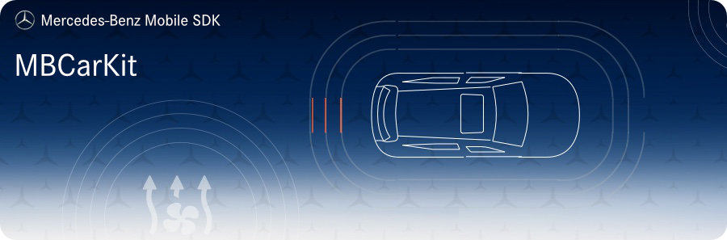

[](https://developer.apple.com/swift/)
[](https://developer.apple.com/swift/)
[](https://developer.apple.com/swift/)


## Requirements

- Xcode 10.3 / 11.x
- Swift 5.0 / 5.1 / 5.2
- iOS 10.0+


## Installation

MBCarKit is available through [CocoaPods](http://cocoapods.org). To install it, simply add the following line to your Podfile:

```ruby
pod "MBCarKit"
```


## Intended Usage

The main part of this module is CarKit, it is the facade to communicate with all provided services. It contains a socketService which can create a socket connection to get live data of the vehicle or send command requests to it. The data of the vehicle gets automatically cached.

## Contributing

We welcome any contributions.
If you want to contribute to this project, please read the [contributing guide](CONTRIBUTING.md).

## Code of Conduct

Please read our [Code of Conduct](https://github.com/Daimler/daimler-foss/blob/master/CODE_OF_CONDUCT.md) as it is our base for interaction.

## License

This project is licensed under the [MIT LICENSE](LICENSE).

## Provider Information

Please visit <https://mbition.io/en/home/index.html> for information on the provider.

Notice: Before you use the program in productive use, please take all necessary precautions,
e.g. testing and verifying the program with regard to your specific use.
The program was tested solely for our own use cases, which might differ from yours.
